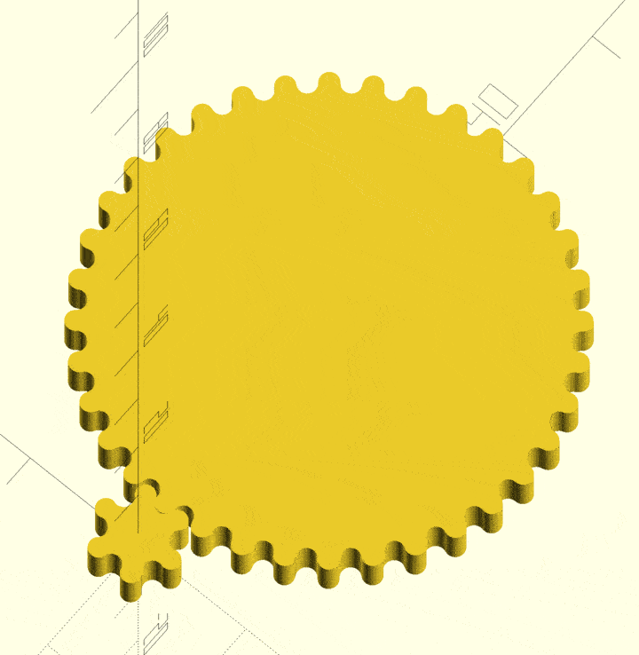

Forked from:
# Cut your own gears with profile shift - OpenSCAD library by Parkinbot on Thingiverse: https://www.thingiverse.com/thing:636119

# Changes
I added a boolean in gears.scad, "cycloid". Set this to true and
instead of the gears being produced from a trapezoidal toothed tool
(resulting in involute gears), the gears are produced from a
semicircular toothed tool resulting in cycloidal gears.

Cycloidal gears are easier to 3D print and more effective than
involute gears at low tooth counts. In most other respects involute
gears are superior, but only if you can actually produce them. An
accurately printed cycloidal gear will tend to outperform a poorly
printed involute.

